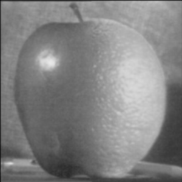

## Multi-resolution Blending - Solution Template

**NOTE:** All values and figures in this template are examples that you will need to replace with your own results

1. **Method Description.** *TODO*: Describe the key implementation details for blending.
Step 0:
The process the pictures into right scale. 

Step1: Build Laplacian pyramids LA and LB from images A and B
```
def get_Laplacian_Stack(iimg, N):
    w = iimg.shape[0]
    h = iimg.shape[1]

    gstack = np.zeros((w,h,N))
    for x in range(0,N):
        sigma = 2**x
        img = get_gaussian_filter(iimg,sigma)
        gstack[:,:,x] = img

    w,h,n = gstack.shape
    stack = np.zeros((w,h,n))
    for x in range(0,n-1):
        img = gstack[:,:,x]-gstack[:,:,x+1]
        stack[:,:,x] = img
        if x == n-2:
            stack[:,:,x+1] = gstack[:,:,x+1]
    return stack
```

Step2: Build a Gaussian pyramid GR from selected region R
```
def get_Gaussian_Stack(iimg, N, alpha):
    w, h= iimg.shape
    stack = np.zeros((w,h,N))
    for x in range(0,N):
        sigma = (2**(x*alpha))
        img = get_gaussian_filter(iimg,sigma)
        stack[:,:,x] = img
    return stack
```

Step3: Form a combined pyramid LS from LA and LB using nodes of GR as weights and blended Collapse the LS pyramid to get the final blended
• LS(i,j) = GR(I,j,)*LA(I,j) + (1-GR(I,j))*LB(I,j)
```
for x in range(0,N):
        left = mask_gstack[:,:,x]*left_lstack[:,:,x]
        right = (1 - mask_gstack[:,:,x])*right_lstack[:,:,x]
        blend += left + right
```


2. **Oraple.** *TODO:* Include visualizations of the Oraple blending along any variations your tried (include both original images and the blended image)
**The original picture is:**

   <div align="center">
      
      
   </div>

**The results:**

* The N is the number of total laplacian level I will have.

* The alpha will affect the simga in the gaussian filter.

N = 5 and alpha = 4
   <div align="center">
      
   </div>
N = 4 and alpha = 4
   <div align="center">
      
   </div>
N = 4 and alpha = 3
   <div align="center">
      
   </div>

3. **Blends of your choice.** *TODO:* Include visualizations of blends of your choice (include both original images and the blended image). Describe any modifications you made on top of what worked for the oraple.