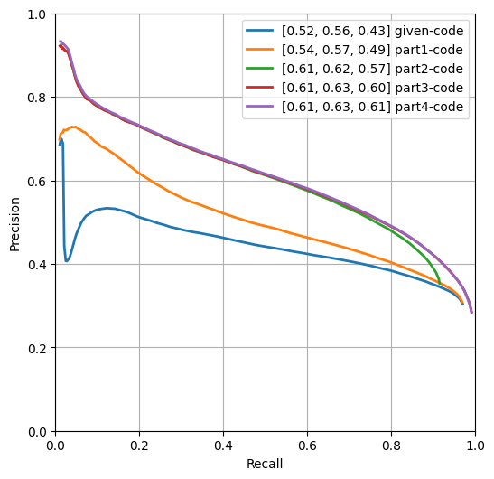
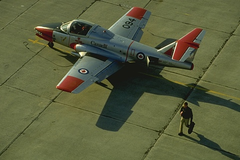
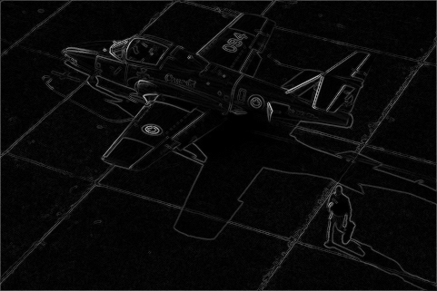
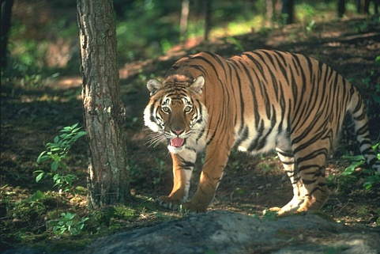
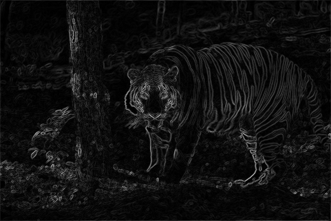
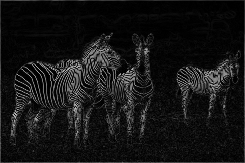

## Contour Detection - Solution Template

**NOTE:** All values and figures in this template are examples that you will need to replace with your own results

1. **Method Description.**: Describe the different mehtods and their key implementation detials.

   **Warm up**:

   I use the spicy.
   ```
   spicy.signal.convolve2d(I,np.array([[-1,0, 1],[-4,0,4],[-1,0,1]]),mode='same', boundary = 'symm'). 
   ```
   I changed the boundary function into "symm", which means symmetrical boundary conditions.

   **Smoothing**:

   We  smooth the image so that we can reduce the amount of edges detected from the noise and apply a low-pass filter.
   In my applications, I firstly use GaussianBlur function to get the blur image. 
   ```
   I = cv2.GaussianBlur(I, (7,7),2)
   ```
   Also, I use derivative of Gaussian filters to obtain more robust estimates of the gradient:
   ```
   dx = signal.convolve2d(I,np.array([[-1,0, 1],[-4,0,4],[-1,0,1]]),mode='same', boundary = 'symm')
   dy = signal.convolve2d(I,np.array([[-1,0, 1],[-4,0,4],[-1,0,1]]).T,mode='same', boundary = 'symm')
   ```
   Then, for the filter, I change the [−1, 0, 1] to np.array([[-1,0, 1],[-4,0,4],[-1,0,1]]) for better results.

   **Non-maximum Suppression**:

   To sharpen the edfes, we will find the local maxima in the gradient image. 
   Here I use this strategy: A gradient is considered locally maximal if it is either greater than or equal to its neighbors in the positive and negative gradient direction.
   For the gradient direction, we calculate the arctangent of the gradient vector:
   ```
   angle = np.arctan2(dy, dx)
   ```
   Then I round it to th nearest 45 degree by the angle mod, so that I can conform to one of 8 discrete directions
   Also, for more accuracy, I use the alpha, which can take the combination of different directions. 
   After than, I compare the the neighbor results with the cernter one. 
   If the neighbor results have a higher "edgeness", we will ignore this center or. Otherwise, we keep it. 

   After that, we normalize our resluts to get the better results. 


2. **Precision Recall Plot.** *TODO*: Use [contour_plot.py](contours/../contour_plot.py) to add curves for the different methods that you implemented into a single plot.
   
   <div align="center">
      
   </div>

3. **Results Table.** : Present the performance metrics for each implementation part in a table format

   | Method | overall max F-score | average max F-score | AP | Runtime (seconds) |
   | ----------- | --- | --- | ---  | --- |
   | Initial implementation | 0.52 | 0.56 | 0.43 | 0.008 |
   | Warm-up [remove boundary artifacts | 0.559771| 0.584352| 0.259602| 0.245163|
   | Smoothing | 0.561291  | 0.583706  | 0.401346  | 0.301801|
   | Non-max suppression | 0.611799|0.633582 | 0.605676| 0.9 |
   | Test set numbers of best model [From gradescope] | 0.611799|0.633582 | 0.605676| 0.9 |

4. **Visualizations.** *TODO:* Include visualization on 3 images (before and after the contour detection). Comment on
   your observations, where does your contour detector work well, where it doesn't and why? you can are also add visualizations of your own images.
   <div align="center">
      
      
      
      
      
      
   </div>
   The contour detector work well when the color differences are obvious. For instance, the strips of the zebras, the strips of the tiger. 
   
   The reason for this is that the change in color can be catch by our [-1,0, 1],[-4,0,4],[-1,0,1]] filure.
   
   The contour detector doesn't work well when the color differences is not obvious, such as the texture of the tree and the grass.

   The reason for this is that it is even hard for the human beings to draw the contour since the noise in color are obvious.


5. **Bells and Whistles.** *TODO*: Include details of the bells and whistles that you
   tried here.

   *TODO*: Present the performance metrics for the bells and whistles in a table format
   
   | Method | overall max F-score | average max F-score | AP | Runtime (seconds) |
   | ----------- | --- | --- | ---  | --- |
   | Best base Implementation (from above) | 0.611799|0.633582 | 0.605676| 0.9 |
   | Bells and whistle (1) The fuunction cv2.GaussianBlur()) can help us to get better  smoothing. 
   At the beginning, I tried the convolve2d(I, gaussian_kernel, mode='same') for the blur, but the cv2.GaussianBlur() generate better results. | 0.561299| 0.580326|  0.401368| 0.191497 |
   | Bells and whistle (2) The improvement of NMS in all directions. Instead of comparing with the 4 neighbour pixels, or the eight neighbor pixels, I also introduce the alpha here, so that we can have the accuracy to 360 degrees, which can generate more accurate resulys for comparing. For instance: it can be the combinayion of both pixel [i + 1, j + 1] and pixel [i, j + 1] ) | 0.576145  | 0.599183  | 0.379651  |0.288801 |
   | Bells and whistle (n) difference start filter. The original filter is the [−1, 0, 1] after GaussianBlur. However, we can change it into np.array([[-1,0, 1],[-4,0,4],[-1,0,1]], np.array([[-1,0, 1],[-3,0,3],[-1,0,1]]) or np.array([[-3,0, 3],[-10,0,10],[-3,0,3]], so that we can find out the differences between colors more clear | 0.611799|0.633582 | 0.605676| 0.9 |