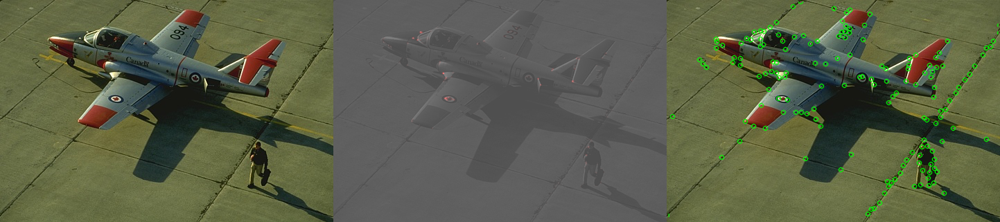

## Corner Detection - Solution Template

**NOTE:** All values and figures in this template are examples that you will need to replace with your own results

1. **Method Description.** *TODO*: Describe the different mehtods and their key implementation detials.

2. **Precision Recall Plot.** *TODO*: Use [corner_plot.py](corner_plot.py) to add curves for the different methods that you implemented into a single plot.

   

      
   

3. **Results Table.** *TODO*: Present the performance metrics for each implementation part in a table format

   | Method | Average Precision | Runtime |
   | ------ | ----------------- | ------- |
   | Random | 0.001 | 0.001   |
   | Harris w/o NMS | | |
   | Harris w/ NMS | | |
   | Hyper-parameters tried (1) | | |
   | Hyper-parameters tried (2) | | |
   | Test set numbers of best model [From gradescope] | | | |
   test case 1,2,3:
   ap = 0.299950
   alpha = 0.05
   kernal_size = (9,9) (11,11) (13,13)
   dxx = cv2.GaussianBlur(dx**2, kernal_size, 1)
   window = 1

   test case 4:
   best ap = 0.300035
   alpha = 0.05
   kernal_size = (7,7)
   sigma = 1
   window = 1

  test case 5:
  best ap = 0.332879
  alpha = 0.05
  kernal_size = (3,3)
  sigma = 1
  window = 1

  test case 6:
  best ap = 0.491765
  I changed my code from [] to range();
  alpha = 0.05
  kernal_size = (3,3)
  sigma = 0

4. **Visualizations.** *TODO:* Include visualization on 3 images. Comment on
   your observations, where does your corner detector work well, where it doesn't and why? We aslo provided some images in [data/vis](data/vis) for testing, but you are free to use your own images as well.
   

      
   

5. **Bells and Whistles.** *TODO*: Include details of the bells and whistles that you
   tried here.

   *TODO*: Present the performance metrics for the bells and whistles in a table format

   | Method | Average Precision | Runtime |
   | ------ | ----------------- | ------- |
   | Best base Implementation (from above) | | |
   | Bells and whistle (1) [extra credit]) | | |
   | Bells and whistle (2) [extra credit]) | | |
   | Bells and whistle (n) [extra credit]) | | |