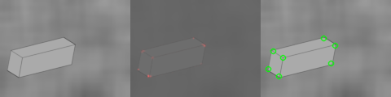

## Corner Detection - Solution Template

**NOTE:** All values and figures in this template are examples that you will need to replace with your own results

1. **Method Description.** : Describe the different methods and their key implementation detials.

The first step is to Calculating image gradients in x and y direction by the 
```  
dx = cv2.Sobel(image_gray, cv2.CV_64F,1, 0)
dy = cv2.Sobel(image_gray, cv2.CV_64F,0, 1)
```
Then, we can use the cv2.GaussianBlur() function to get the dxx, dxy, dyy. 
Then, by the math, by can calculate the cornerness score value of each point by
```
detM = dxx * dyy - dxy**2
traceM = (dxx+dyy)**2
response = detM - alpha * traceM 
```
The alpha is between 0.04 to 0.06.

For the  Non maximum suppression. The method I use is to compare cornerness score value with the cloeset 8 pixels. If its cornerness score value is smaller than the neighbor, it will be reset to 0. Otherwise, we keep it. 

And we always nomalize our results to 0 to 255 at the end. 

2. **Precision Recall Plot.** *TODO*: Use [corner_plot.py](corner_plot.py) to add curves for the different methods that you implemented into a single plot.

   <div align="center">
      
   </div>

3. **Results Table.** *TODO*: Present the performance metrics for each implementation part in a table format

   | Method | Average Precision | Runtime |
   | ------ | ----------------- | ------- |
   | Random | 0.001 | 0.001   |
   | Harris w/o NMS |0.445783 | 0.182202|
   | Harris w/ NMS | 0.491765 | 0.09|
   | Hyper-parameters tried (1) alpha = 0.05;kernal_size = (5,5);sigma = 0; window = 1 | 0.437521| 0.185428|
   | Hyper-parameters tried (2) alpha = 0.05; kernal_size = (7,7);sigma = 1; window = 1 | 0.445783| 0.188328|
   | Test set numbers of best model [alpha = 0.05;kernal_size = (3,3);sigma = 0; window = 1] | 0.491765 | 0.09|


4. **Visualizations.** *TODO:* Include visualization on 3 images. Comment on
   your observations, where does your corner detector work well, where it doesn't and why? We aslo provided some images in [data/vis](data/vis) for testing, but you are free to use your own images as well.
   <div align="center">
      
   </div>

5. **Bells and Whistles.** *TODO*: Include details of the bells and whistles that you
   tried here.

   *TODO*: Present the performance metrics for the bells and whistles in a table format

   | Method | Average Precision | Runtime |
   | ------ | ----------------- | ------- |
   | Best base Implementation (from above) | | |
   | Bells and whistle (1) compare with more than 8 pixels. Instead of finding the eight neibors around the pixel for NMS, we can calculate the pixels within a range and find the pixles within the radius. Although it turns out that the radius of 1 is the best results, which is similar to compare with the 8 closest pixels. | 0.48257| 0.10|
   | Bells and whistle (2) [extra credit]) | | |
   | Bells and whistle (n) [extra credit]) | | |