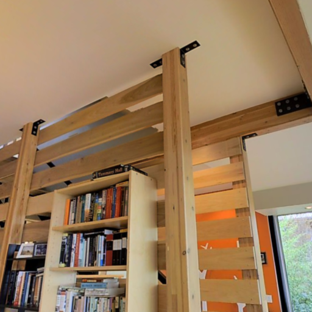
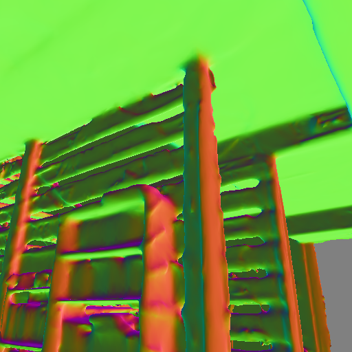

## ECE549 / CS543 Computer Vision: Assignment 4

### Instructions 

1.  Assignment is due at **11:59:59 PM on Wednesday April 28 2021**.

2.  See [policies](http://saurabhg.web.illinois.edu/teaching/ece549/sp2021/policies.html)
    on [class website](http://saurabhg.web.illinois.edu/teaching/ece549/sp2021/).

3.  Submission instructions:
    1. A single `.pdf` report that contains your work for Q1, Q2. For each individual question,
       we provide instruction for what should be included in your report. This should be submitted
       under `MP4` on gradescope. 
    2. For this assignment, we will use *gradescope autograder* for code submission and evaluation of your results on held-out test sets.
       For this to work, you will need to submit the code and results according to the following instructions:
       - Code and output files should be submitted to [Gradescope](https://www.gradescope.com) under `MP4-code` with the following structure:
         ```
         # Q1 code
         CS543_MP4_part1_starter_code.py
         # Q1 results
         Q1_label_predictions.npy (we provide code to generate these using your models, see below)
         # Q2 code
         CS543_MP4_part2_starter_code.py
         # Q2 results (we provide code to generate these using your models, see below)
         Q2_normal_predictions/
           test_001.png
           test_002.png
           ...
           test_200.png
         ```
       - Do not compress the files into `.zip` as this will not work.
       - Do not submit any `.ipynb` file from Colab, you can convert it to python files by `File → Download → Download .py`.
       - File and folder names are case sensitive.
       - *Not following this instruction to submit your code and results will lead to a loss of 100% of assignment points.*
       - While we are not placing any limits on the number of times you can run your output through the auto-grader, we expect that
         you will limit yourself to a maximum of 2 valid submissions per day. You should primarily use the validation sets 
         for seeing how well you are doing and for picking hyper-parameters, and ideally we expect you to only submit the output
         of your final models to the test set. Hyper-parameters should not be tweaked on the test set. We can see the submission history and if we find too many submission to the test server in too short a time, we will penalize for it.

4.  Lastly, be careful not to work of a public fork of this repo. Make a
    private clone to work on your assignment. You are responsible for
    preventing other students from copying your work. Please also see point 2
    above.

### Google Colab and Dataset setup
In this assignment you will use [PyTorch](https://pytorch.org/), which is currently one of the most popular
deep learning frameworks and is very easy to pick up. It has a lot of tutorials and an active community answering
questions on its discussion forums. You will be using [Google Colab](https://colab.research.google.com/), a free environment
to run your experiments. Here are instructions on how to get started:

1. Login with your Illinois Google account. Note: you will not have access to starter codes using account outside
the illinois.edu domain.

2. Open [Q1 Starter code](https://colab.research.google.com/drive/12vajPOzAANPpBsaEzrkKn_udBzeJrRr1?usp=sharing) and 
[Q2 Starter code](https://colab.research.google.com/drive/1v7JXxIEzYpIMsgIMCS5SC_41rPLA01IC?usp=sharing),
click on File in the top left corner and select `Save a copy in Drive`.
This should create a new notebook, and then click on `Runtime → Change Runtime Type → Select GPU as
your hardware accelerator`. Make sure you copy both Q1 and Q2 to your Drive.

3. In your Google Drive, create a new folder titled `CS_543_MP4`. This is the folder that will be mounted to Colab.
All outputs generated by Colab Notebook will be saved here.

4. Follow the instructions in the notebook to finish the setup.

5. Keep in mind that you need to keep your browser window open while running Colab. Colab does not allow
long-running jobs but it should be sufficient for the requirements of this assignment.

### Problems

1. **Implement and improve BaseNet on CIFAR-10 [30 pts].** For this part of the assignment, you will be working with
    the [CIFAR-10](https://www.cs.toronto.edu/~kriz/cifar.html) dataset. This dataset consists of 60K 32 × 32 color images from
    10 classes. There are 50K training images and 10K validation images. The images in CIFAR-10 are of size
    3 × 32 × 32, i.e. three-channel RGB images of 32 × 32 pixels.

    <div align="center">  </div>

    1. **Implement BaseNet [5 pts].** Implement the BaseNet with the neural network shown below.
       The starter code for this is in the BaseNet class. After implementing
       the BaseNet class, you can run the code with default settings to get a
       baseline accuracy of around 60% on the validation set. The BaseNet is
       built with following components:
       * Convolutional, i.e. `nn.Conv2d`
       * Pooling, e.g. `nn.MaxPool2d`
       * Fully-connected (linear), i.e. `nn.Linear`
       * Non-linear activations, e.g. `nn.ReLU`
       BaseNet consists of two convolutional modules (conv-relu-maxpool) and
       two linear layers. The precise architecture is defined below:

       | Layer No. | Layer Type  | Kernel Size | Input Dim | Output Dim  | Input Channels | Output Channels |
       | --------- | ----------- | ----------- | --------- | ----------- | -------------- | --------------- |
       | 1         | conv2d      | 5           | 32        | 28          | 3              | 6               |
       | 2         | relu        | -           | 28        | 28          | 6              | 6               |
       | 3         | maxpool2d   | 2           | 28        | 14          | 6              | 6               |
       | 4         | conv2d      | 5           | 14        | 10          | 6              | 16              |
       | 5         | relu        | -           | 10        | 10          | 16             | 16              |
       | 6         | maxpool2d   | 2           | 10        | 5           | 16             | 16              |
       | 7         | linear      | -           | 1         | 1           | 400            | 200             |
       | 8         | relu        | -           | 1         | 1           | 200            | 200             |
       | 9         | linear      | -           | 1         | 1           | 200            | 10              |

       **In your report, include:** your model by using Python print command
       `print(net)` and final accuracy on the validation set.

    2. **Improve BaseNet [20 pts].** 
       Your goal is to edit the BaseNet class or make new classes for devising
       a more accurate deep net architecture.  In your report, you will need to
       include a table similar to the one above to illustrate your final
       network.
       
       Before you design your own architecture, you should start by getting
       familiar with the BaseNet architecture already provided, the meaning of
       hyper-parameters and the function of each layer. This
       [tutorial](https://pytorch.org/tutorials/beginner/blitz/neural_networks_tutorial.html)
       by PyTorch is helpful for gearing up on using deep nets. Also, see
       Andrej Karpathy's lectures on
       [CNNs](http://cs231n.github.io/convolutional-networks/) and [neural
       network training](http://cs231n.github.io/neural-networks-3/).

       For improving the network, you should consider the following aspects.
       In addition, you can also try out your own ideas. Since Colab makes only
       limited computational resources available, we encourage you to
       rationally limit training time and model size. *Do not simply just copy
       over model architectures from the Internet.*

       * **Data normalization.** Normalizing input data makes training easier
       and more robust. You can normalize the data to made it zero mean and fixed standard
       deviation ($`\sigma = 1`$ is the go-to choice).  You may use
       `transforms.Normalize()` with the right parameters for this data
       normalization. After your edits, make sure that `test_transform` has the
       same data normalization parameters as `train_transform`.
       * **Data augmentation.** Augment the training data using random crops,
       horizontal flips, etc. You may find functions `transforms.RandomCrop()`,
       `transforms.RandomHorizontalFlip()` useful. Remember, you shouldn't
       augment data at test time. You may find the [PyTorch
       tutorial](https://pytorch.org/tutorials/beginner/data_loading_tutorial.html#transforms)
       on transforms useful.
       * **Deeper network.** Experiment by adding more convolutional and fully
       connected layers. Add more convolutional layers with increasing output
       channels and also add more linear (fully convolutional) layers.
       * **Normalization layers.** [Normalization
       layers](https://pytorch.org/docs/master/nn.html#normalization-functions)
       may help reduce overfitting and improve training of the model. Add
       normalization layers after conv layers (`nn.BatchNorm2d`). Add
       normalization layers after linear layers and experiment with inserting
       them before or after ReLU layers (`nn.BatchNorm1d`).

       **In your report, include:** 
       - Your best model. Include final accuracy on validation set, table
         defining your final architecture (similar to the BaseNet table above),
         training loss plot and test accuracy plot for final model
         (auto-generated by the notebook). A reasonable submission with more
         than 85% accuracy will be given full credit for this part.
       - An ablation table, listing all factors that you tried to make
         improvement to your final model as well as the corresponding validation 
         accuracy.

    3. **Secret test set [5 pts].** We also have a secret test set containing
       2000 images similar to CIFAR-10, under
       [Q1_test_data](Q1_test_data).  Please copy the
       `cifar10_secret_test_data.npy` to `CS_543_MP4/data/cifar10-test` on your
       Google Drive.  We provide code that saves your model predictions to a
       `predictions.npy` file. Submit the prediction for your best model to
       gradescope. If you want, you can also show your scores on the class
       leaderboard, and challenge your classmates to beat you!  
       
       **We will give upto 5pts of extra credits to top performing entries on 
       the leaderboard!**

       **In your report, include:** Test set accuracy (category-wise and aggregate) 
       for your best model. You can get this from gradescope. A reasonable submission 
       with more than 70% accuracy will be given full credit for this part.

2. **Surface normal [40 pts].** In this part, you will build your own surface
    normal estimation model on a subset of the [Taskonomy
    dataset](http://taskonomy.stanford.edu/). This task comprises of predicting the
    normal vector at every pixel location. We will be using the mean and median
    angular error as well as accuracy at 11.25$`^{o}`$, 22.5$`^{o}`$, 30$`^{o}`$ to
    measure performance. We provide code for computing these metrics.

    <div align="center">
    
    
    </div>

    **Data.** We have 278 images for training, and 234 images for testing. Each image is
    512x512. We provide a basic data loader that you can build upon.

    **What you need to do:**
    
    1. **Implement training cycle:** Unlike Part 1 where we provided you with 
       the training cycle, you will implement it all by yourself this time.
       Make sure you evaluate metrics and loss on the validation set every so
       often to check for overfitting.
    2. **Build on top of ImageNet pre-trained Model [15 pts]:** Once you have a
       training cycle set up, you should design models for solving the task. To
       make training faster, we will build a model on top of a ResNet-18 [^1]
       model that has been pre-trained on the ImageNet dataset (via
       `models.resnet18(pretrained=True)`).  These models are trained to predict
       the 1000 ImageNet object classes. To use this model for surface normal
       estimation, you will have to remove the classifier and global average
       pooling layers, and stack on additional layers for surface normal
       estimation. Note that, ResNet-18 model downsamples the input image by a
       factor of 32, remeber to upsample your prediction using bilinear
       interpolation.  Since surface normal estimation is not a classification
       task anymore, you should also play with the loss function.  Example of
       loss functions that you can try are: L1 loss, cosine similarity loss.
       You can refer to [^2] [^3] for inspiration for how
       you can build on top of such pre-existing models. Again, carefully
       document the design choices you make in your report.  
       
       For reference, our very basic first implementation is able to do 1 training epoch in 20s,
       and achieves decent performance in under 20 minutues of training: a mean 
       angular error of 35.5$`^{o}`$, a median angular error of 30.2$`^\{o}`$, 
       and accuracies of 17.8%, 38.3%, 49.7% at error thresholds of 11.25$`^{o}`$, 
       22.5$`^{o}`$, and 30$`^{o}`$ respectively. Note
       that, lower is better for mean angular error and median angular error and
       higher is better for accuracies. At the very least your
       implementation should achieve similar performance on the validation set,
       but you may be able to do better with more training. We care most about
       the mean angular error out of these 5 metrics.

       Below is the performance of ResNet-18 model.

       | mean angular error (lower the better)   | median angular error (lower the better)  | accuracies at 11.25 degree (higher the better) | accuracies at 22.5 degree (higher the better)   | accuracies at 30 degree (higher the better)  | 
       | ----------- | ----------- | ----------- | ----------- | ----------- | 
       | 35.5 | 30.2 | 17.8% | 38.3% | 49.7% | 

       Here are some sample prediction outputs using ResNet-18 model.
       
       <div align="center">  </div>

       **In your report, include:** your model in the report by using Python
       print command `print(net)`, and final performance on validation set (all 5
       metrics).

    3. **Increase your model output resolution [15 pts]:** The current model
       simply replaces the final fully connected layer in a ResNet-18 model for
       surface normal estimation. This still has a lot of draw backs. The
       most important factors that causes poor performance is the low output
       resolution. ResNet-18 model for image classification downsamples the input
       image by a factor of 32. In the previous step, we recover the resolution by
       a simple bilinear interpolation layer which upsamples the prediction by 32
       times. In this part, our goal is to explore other choices to generate
       high-resolution predictions. We offer two choices that you can consider:
       * **Atrous (or dilated) convolution.** The concept of atrous convolution 
         (or dilated convolution) is described it the DeepLab paper[^4].
         One way to think about atrous convolution is to think of running the 
         network on shifted versions of the image and weaving the outputs together
         to produce an output at the original spatial resolution. This can be done
         simply by using the `dilataion` arguments in PyTorch. Refer to the paper[^4] 
         and PyTorch documentation for more detail.
       * **Building a learned upsampler.**  Instead of using bilinear upsampling,
         you can use a decoder that *learns* to upsample 
         prediction to improve the output quality. The key that
         makes decoder works better than bilinear interpolation is the usage of
         *skip-connection*.  Refer to the U-net[^3] and DeepLabv3+[^5] for
         more detail.

        You can implement either of these two choices, or other choices you
        find in other papers to increase your model output resolution. Please
        describe the methods you try in your report and report their
        performance.  For reference, our implementation with a DeepLabv3+
        decoder achieves a mean angular error of 31.7, a median angular error
        of 22.4, and accuracies at 11.25$`^{o}`$, 22.5$`^{o}`$, 30$`^{o}`$ are
        31.3%, 50.1%, 58.9% respectively. Your best model should achieve
        similar performance.

        Below is the performance of ResNet-18 model with DeepLabv3+ decoder.

        | mean angular error (lower the better)   | median angular error (lower the better)  | accuracies at 11.25 degree (higher the better) | accuracies at 22.5 degree (higher the better)   | accuracies at 30 degree (higher the better)  | 
        | ----------- | ----------- | ----------- | ----------- | ----------- | 
        | 31.7 | 22.4 | 31.3% | 50.1% | 58.9% | 

        And here are some sample prediction outputs using DeepLabv3+ decoder.

        <div align="center">  </div>

       **In your report, include:**
       - Your best model. Include final performance on validation set (5 metrics).
       - An ablation table, listing all factors that you tried to make
         improvement to your final model as well as the validation performance.


    4. **Visualize your prediction [5 pts]:** In your report, visualize
       5 predictions of your model on images that are not in the dataset. We
       provide functions to visualize arbitrary images. You just need to place
       your images under `./data/normal_visualization/images` and run the appropriate
       code cell in colab. Take images
       of your choice and test the model with them. We also provide
       some example images under [normal_visualization](normal_visualization).

       **In your report, include:** 
       - visualization of model prediction on five of your favorite indoor images
       - visual comparisons of the output from part 2 and 3 on 2 images from the 
         validation dataset, discuss your observations.

    5. **Secret test set [5 pts].** 
       We have created a secret test set containing 200 images of indoor pictures
       under [Q2_test_data](Q2_test_data).  Please unzip and copy the
       `Q2_test_data` folder to `CS_543_MP4/data/Q2_test_data` on your Google
       Drive. We provide code that saves your model predictions to a
       `Q2_normal_predictions` folder. Submit the prediction for your best
       model to gradescope. If you want, you can also show your scores on the
       class leaderboard, and challenge your classmates to beat you!  
       
       **We will give upto 5pt extra credits to top performing entries on the
       leaderboard!**

       For reference our performance with DeepLabv3+ decoder, on this secret 200 image test data is as follows:

       | mean angular error (lower the better)   | median angular error (lower the better)  | accuracies at 11.25 degree (higher the better) | accuracies at 22.5 degree (higher the better)   | accuracies at 30 degree (higher the better)  | 
       | ----------- | ----------- | ----------- | ----------- | ----------- | 
       | 29.1 | 19.3 | 33.6% | 55.0% | 64.1% | 

       **In your report, include:** test set accuracy of your best model. 
       You can get this from gradescope. Your model performance on the secret test
       set would ideally be similar to the performance you get on the validation set.

### References
[^1]: Kaiming He et al. "Deep residual learning for image recognition." CVPR 2016.
[^2]: Long, Jonathan, Evan Shelhamer, and Trevor Darrell. "Fully convolutional networks for semantic segmentation." CVPR 2015.
[^3]: Olaf Ronneberger et al. "U-net: Convolutional networks for biomedical image segmentation." MICCAI 2015.
[^4]: Liang-Chieh Chen et al. "Semantic image segmentation with deep convolutional nets and fully connected CRFs." ICLR 2015.
[^5]: Liang-Chieh Chen et al. "Encoder-decoder with atrous separable convolution for semantic image segmentation." ECCV 2018.
