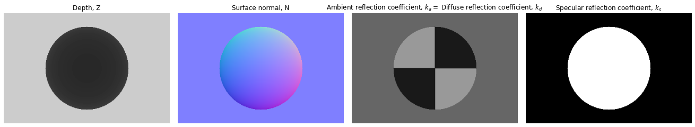
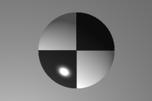

### Problems


1. **Phong Shading Model .** In this problem, we will take a closer
    look at different types of surfaces and their appearance under varying
    lighting and viewing conditions. We will work with the 
    ambient + lambertian + specular model for image formation (see Section 2.2,
    Equation 2.94 in [Szeliski](https://szeliski.org/Book/). In particular,
    we will work with the following equation for the intensity at a given pixel
    $`x`$:
    
    ```math
    I(x) = \text{Ambient Term} + \text{Diffuse Term} + \text{Specular Term} \\
    I(x) = k_a L_a + k_d \sum_i L_i [\hat{v}_i \cdot \hat{n}]^{+} + k_s \sum_i L_i ([\hat{v}_r \cdot \hat{s}_i]^{+})^{k_e}.
    ```

    Here,
    - The ambient term, is simply the ambient reflection coefficient, $`k_a`$,
      times the ambient light, $`L_a`$.
    - The diffuse term, assumes that the surface is lambertian, that is, it
      reflects incoming light, $`L_i`$ multiplied by the diffuse reflection
      coefficient $`k_d`$, equally in all directions. However, we need to pay
      attention to the amount of light that is coming in.  It depends on the
      angle at which light is incident onto the surface. It is given by the dot
      product $`\hat{v}_i \cdot \hat{n}`$ between the surface normal at the
      point $`\hat{n}`$, and the direction from which light is incident
      $`\hat{v}_i`$. $`[\cdot]^{+}`$ denotes the $`\max`$ with $`0`$.
    - For the specular term, the light gets reflected preferentially in
      directions close to the actual direction of reflection. In particular, we
      will use a dependence of the form $`(\hat{v}_r \cdot \hat{s}_i)^{k_e}`$,
      where $`\hat{s}_i`$ is the direction of reflection, $`\hat{v}_r`$ is the
      viewing direction, and $`k_e`$ is the shininess coefficient.
    - We are going to ignore shadows and inter-reflections: 
      - As long as the surface is facing the light source, we will assume that
        the surface will receive light from the light source.
      - A surface only receives light directly from the point / directional
        light sources, or the ambient light.
    - Lastly, we are also going to ignore the $`1/r^2`$ attenuation for point
      light sources.

    As part of this problem, we will simulate these three terms and use it to
    render a simple scene. We will provide the per-pixel scene depth, surface
    normal, and the different coefficients $`k_a`$, $`k_d (=k_a)`$ and $`k_s`$; as
    well as the strength and locations of the various lights in the scene. Your
    task is to compute the image based on this information using the
    Phong Shading model described above.

    We have provided a scene with a sphere in front of a wall. You can access
    this scene using the `get_ball` function from the file
    [generate_scene.py](q3_code/generate_scene.py). It returns the per-pixel
    depth, surface normal and $`k_a`$, $`k_d`$ and $`k_s`$ for the scene, as
    visualized below (you can assume a reasonable value for $`k_e`$ (say 50)):
    <div align="center">
    
    </div>

    We have also provided some starter code in
    [render_image.py](q3_code/render_image.py) that sets up the different test
    cases (positions of lights). Your task is to fill in the `render` function
    that implements the Phong shading model as described above.  An
    example rendering that your code will produce is shown below.
    <div align="center">
    
    </div>

    **Include the renderings generated by running `render_image.py` in your
    report.  Also include a brief description of how you calculate the
    different directions, $`\hat{n}`$, $`\hat{v}_i`$, $`\hat{v}_r`$ and
    $`\hat{s}_i`$, for each pixel in the image.** 

4. **Dynamic Perspective.** In this question, we will simulate optical
    flow induced on the image of a static scene due to camera motion.
    You can review these concepts from [lecture 6](http://saurabhg.web.illinois.edu/teaching/ece549/sp2021/slides/lec05_dynamic_perspective.pdf).
    For this problem (including both 4.1 and 4.2), you can assume that the
    X-axis points to the right, Y-axis points down and Z-axis points into the scene.

    1. Assuming a camera moving with translation velocity of $`t`$
        and angular velocity of $`\omega`$. Derive the equation that governs the
        optical flow at a pixel $`(x, y)`$ in terms of the focal length $`f`$,
        and the depth of the point $`Z(x, y)`$. Note that a point $`(X, Y, Z)`$
        in the world projects to $`(f\frac{X}{Z}, f\frac{Y}{Z})`$ in the image.

    2. Next, we will try to visualize the optical flow induced on
        the image of a static scene due to camera motion. We will build off
        starter code in [dynamic_perspective_starter.py](q4_code/dynamic_perspective_starter.py).
        We have implemented two simple scenes, that of a vertical wall directly
        in front of the camera (`get_wall_z_image`), and that of a camera overlooking
        a horizontal plane (`get_road_z_image`). Your task is to use these scenes
        to visualize the induced optical flow for the following situations:

        1. Looking forward on a horizontal plane while driving on a flat road.
        2. Sitting in a train and looking out over a flat field from a side window.
        3. Flying into a wall head-on.
        4. Flying into a wall but also translating horizontally, and vertically.
        5. Counter-clockwise rotating in front of a wall about the Y-axis.

        You should pick the appropriate scene, $`t`$ and $`w`$, and visualize
        the induced optical flow (you can use the `plot_optical_flow` function).
        Include the generated optical flow in your report. Note that the origin
        (for the perspective projection equations) is at the center of the camera,
        and this is different from the origin for images in numpy.
